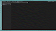

<h1>README.md-Generator</h1>

### Contributions are Welcome

## Description

**assignment as part of coding bootcamp**

A README.md generator which runs by prompting the user for responses in the console and generates a markdowm README file using the received user's input injected into a README.md template, similar to the format of this README document.  

## About the Project
This is another homework assignment for the UofA coding bootcamp.
I referenced an article on "How to Write Beautiful and Meaningful README.md written by Divyansh Tripathi<a href="https://silentlad.com/how-to-write-beautiful-and-meaningful-readme.md">(here)</a>posted under his username <a href="https://github.com/silent-lad">@silent-lad</a> on his website <a href="https://silentlad.com">silentlad.com</a>.
I found the article to be insightful and it helped me to arrange and think about a README's importance more. 

## Technologies used
JavaScript- Utilizing Node.ja with npm & inquirer  fs

## Future Scope

## Licence
N/A
